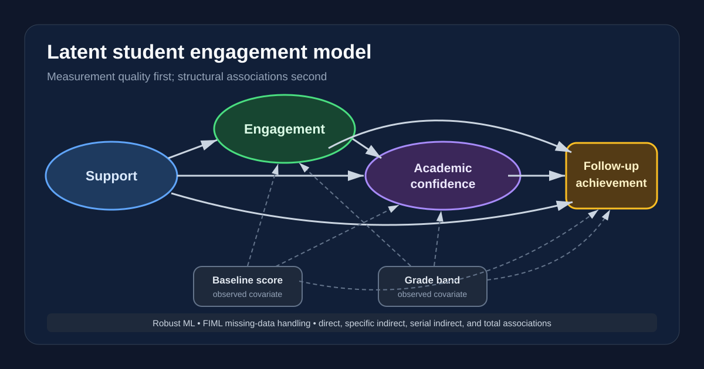
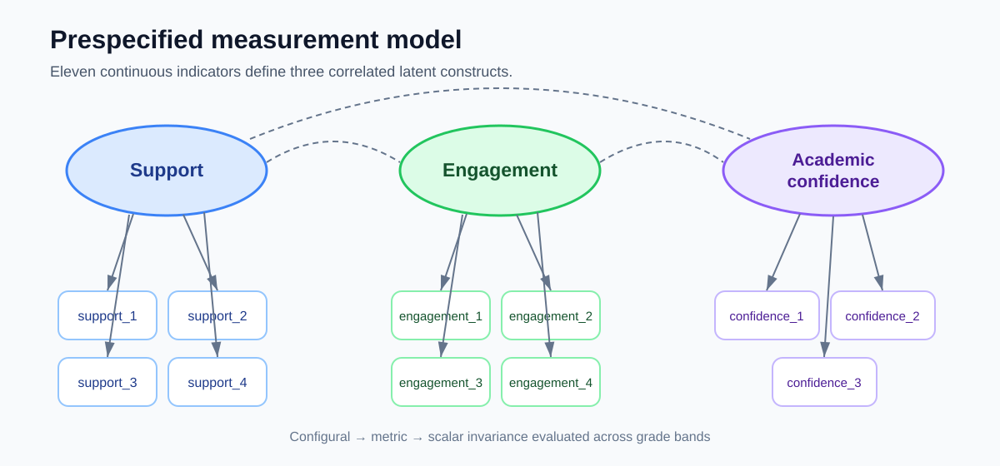

# Structural Equation Modeling of Student Engagement

[](https://github.com/mjeans/structural-equation-modeling/actions/workflows/validate.yml)

An end-to-end R and `lavaan` case study connecting measurement quality to a structural model of student support, engagement, academic confidence, and later achievement. The project demonstrates confirmatory factor analysis, measurement invariance, full-information maximum likelihood, latent-variable mediation, model diagnostics, and careful interpretation.

> All records are deterministic and synthetic. No student, school, district, or client data are included.



## Research question

How are perceived support, student engagement, and academic confidence associated with later achievement after accounting for baseline performance and grade band—and is the measurement structure sufficiently comparable across middle- and high-school students to support group comparisons?

The workflow separates that question into two stages:

1. **Measurement:** Do 11 survey indicators represent three distinct latent constructs, and do the loadings and intercepts operate similarly across grade bands?
2. **Structure:** Are support, engagement, confidence, and follow-up achievement connected through the prespecified direct and indirect pathways?

## What the project demonstrates

- Three-factor confirmatory factor analysis with robust maximum likelihood
- Configural, metric, and scalar measurement-invariance testing
- Model comparison using changes in CFI and RMSEA rather than chi-square alone
- Full-information maximum likelihood for incomplete continuous indicators
- Composite reliability and average variance extracted
- A latent-variable structural model with serial and specific indirect effects
- Baseline and grade-band covariate adjustment
- Standardized path estimates, confidence intervals, and explained variance
- Residual-variance and modification-index diagnostics
- Deterministic synthetic data, automated tests, and GitHub Actions
- Explicit separation of statistical association from causal interpretation

## Measurement model



The prespecified model includes:

- **Support:** four indicators of relational and instructional support
- **Engagement:** four indicators of behavioral and cognitive engagement
- **Academic confidence:** three indicators of perceived academic capability

The same factor structure is evaluated in middle- and high-school groups. Configural invariance tests the shared pattern, metric invariance constrains loadings, and scalar invariance additionally constrains intercepts. The decision rules flag a step when absolute CFI deterioration exceeds 0.010 or RMSEA increases by more than 0.015.

## Structural model

The final model estimates:

- support → engagement
- support and engagement → academic confidence
- support, engagement, and confidence → follow-up achievement
- baseline performance and grade band as observed covariates
- support’s specific and serial indirect associations with achievement

The serial indirect path is `support → engagement → confidence → follow-up achievement`. Bootstrap language is intentionally avoided because the reference workflow uses robust maximum-likelihood standard errors; the project reports model-based confidence intervals and labels that distinction clearly.

## Repository map

```text
R/            Synthetic data generation and reusable SEM reporting helpers
scripts/      Data, CFA/invariance, SEM, and diagnostic entry points
config/       Prespecified measurement and structural models
tests/        Reproducibility, fit, invariance, mediation, and solution checks
docs/         Analysis plan, model card, data dictionary, and decision memo
assets/       Measurement and structural model diagrams
outputs/      Documentation for reproducibly generated result tables
.github/      Continuous-integration workflow
```

## Reproduce the analysis

R and `lavaan` are the only requirements.

```bash
install.packages("lavaan")
make all
```

Or run the stages separately:

```bash
Rscript scripts/01_generate_data.R
Rscript scripts/02_measurement_models.R
Rscript scripts/03_structural_model.R
Rscript scripts/04_diagnostics.R
Rscript tests/test_pipeline.R
```

Generated record-level data, fitted model objects, and result tables are ignored by Git. The scripts regenerate them deterministically, and continuous integration executes the entire workflow on every pull request.

## Interpretation boundary

The structural paths are conditional associations within a synthetic cross-sectional measurement design with a later observed outcome. Model fit does not prove the model is true, establish temporal ordering among the latent constructs, eliminate omitted-variable bias, or identify causal effects. A real application would require instrument validation, sampling and clustering review, preregistration where appropriate, sensitivity analyses, and replication in an independent cohort.

See the [analysis plan](docs/analysis-plan.md), [model card](docs/model-card.md), [data dictionary](docs/data-dictionary.md), and [decision memo](docs/decision-memo.md).

Built as a public portfolio demonstration by [Matthew Jeans, PhD](https://github.com/mjeans).
