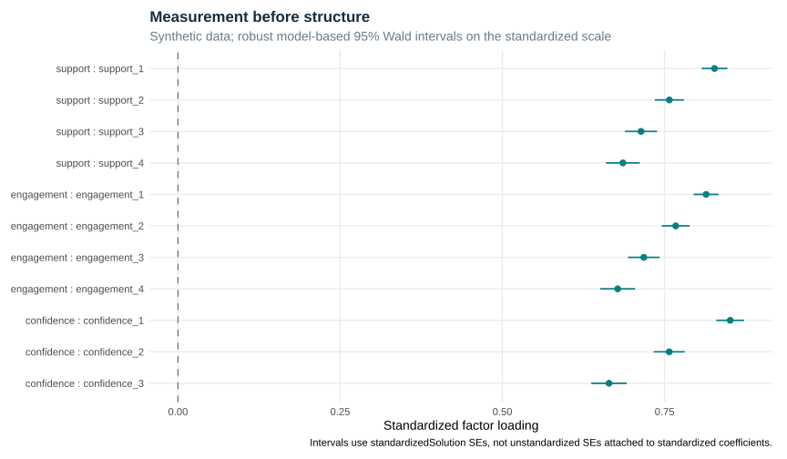
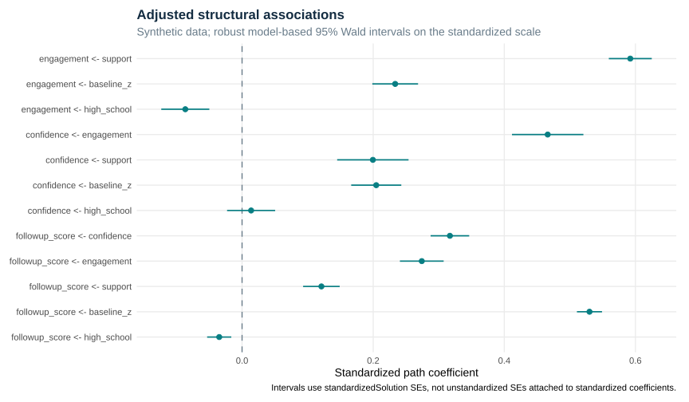

# Executed measurement and structural-model report

## Question and population

Do 11 continuous survey indicators recover support, engagement, and confidence, and how are these latent constructs associated with later achievement? The 2,400 records are synthetic; the generating structure is known. Robust maximum likelihood with FIML handles incomplete continuous indicators under the modeled missing-at-random assumptions.

## Measurement evidence

| model | cfi | tli | rmsea | srmr |
| --- | --- | --- | --- | --- |
| pooled_cfa | 0.998 | 0.997 | 0.015 | 0.012 |
| structural_model | 0.998 | 0.998 | 0.013 | 0.015 |

| lhs | rhs | est.std | se | ci.lower | ci.upper |
| --- | --- | --- | --- | --- | --- |
| support | support_1 | 0.827 | 0.010 | 0.807 | 0.847 |
| support | support_2 | 0.757 | 0.011 | 0.735 | 0.780 |
| support | support_3 | 0.714 | 0.013 | 0.689 | 0.738 |
| support | support_4 | 0.686 | 0.013 | 0.660 | 0.712 |
| engagement | engagement_1 | 0.814 | 0.010 | 0.795 | 0.833 |
| engagement | engagement_2 | 0.767 | 0.011 | 0.746 | 0.789 |
| engagement | engagement_3 | 0.718 | 0.012 | 0.693 | 0.742 |
| engagement | engagement_4 | 0.678 | 0.014 | 0.651 | 0.705 |
| confidence | confidence_1 | 0.851 | 0.011 | 0.830 | 0.873 |
| confidence | confidence_2 | 0.757 | 0.012 | 0.733 | 0.781 |
| confidence | confidence_3 | 0.664 | 0.014 | 0.637 | 0.692 |

### Group comparability

| model | chisq | df | p_value | cfi | tli | rmsea | rmsea_lower | rmsea_upper | srmr | delta_cfi | delta_rmsea |
| --- | --- | --- | --- | --- | --- | --- | --- | --- | --- | --- | --- |
| configural | 104.944 | 82 | 0.045 | 0.998 | 0.997 | 0.015 | 0.003 | 0.023 | 0.017 | Not reported | Not reported |
| metric | 112.819 | 90 | 0.052 | 0.998 | 0.997 | 0.015 | 0.000 | 0.022 | 0.019 | 0 | -0.001 |
| scalar | 123.832 | 98 | 0.040 | 0.997 | 0.997 | 0.015 | 0.003 | 0.022 | 0.019 | 0 | 0.000 |

[Composite reliability](reliability.csv) and [indicator missingness](missingness_summary.csv). Excellent fit is expected under the data-generating model, not a promise of comparable real-data fit.

## Structural associations

| lhs | rhs | est.std | se | ci.lower | ci.upper |
| --- | --- | --- | --- | --- | --- |
| engagement | support | 0.592 | 0.017 | 0.559 | 0.625 |
| engagement | baseline_z | 0.234 | 0.018 | 0.199 | 0.268 |
| engagement | high_school | -0.087 | 0.019 | -0.123 | -0.050 |
| confidence | engagement | 0.466 | 0.028 | 0.412 | 0.521 |
| confidence | support | 0.200 | 0.028 | 0.145 | 0.254 |
| confidence | baseline_z | 0.205 | 0.020 | 0.166 | 0.243 |
| confidence | high_school | 0.014 | 0.019 | -0.023 | 0.050 |
| followup_score | confidence | 0.317 | 0.015 | 0.288 | 0.346 |
| followup_score | engagement | 0.274 | 0.017 | 0.241 | 0.308 |
| followup_score | support | 0.121 | 0.014 | 0.093 | 0.149 |
| followup_score | baseline_z | 0.530 | 0.010 | 0.511 | 0.549 |
| followup_score | high_school | -0.035 | 0.009 | -0.053 | -0.016 |

### Indirect associations (unstandardized scale)

| lhs | est | se | ci.lower | ci.upper |
| --- | --- | --- | --- | --- |
| support_to_confidence_indirect | 0.373 | 0.029 | 0.317 | 0.430 |
| support_to_outcome_via_engagement | 2.196 | 0.159 | 1.884 | 2.507 |
| support_to_outcome_via_confidence | 0.856 | 0.128 | 0.605 | 1.106 |
| support_to_outcome_serial | 1.184 | 0.100 | 0.988 | 1.380 |
| support_to_outcome_total_indirect | 4.235 | 0.191 | 3.861 | 4.610 |
| support_to_outcome_total | 5.872 | 0.189 | 5.502 | 6.243 |

The indirect-effect table uses unstandardized estimates and matching unstandardized intervals. The plots use standardizedSolution estimates and corresponding standardized-scale SEs. Neither uses bootstrap intervals.

## Diagnostics and limitations

Fully observed baseline and binary grade covariates are treated as fixed (fixed.x = TRUE). The prior specification estimated their moments and produced a near-zero robust covariance direction concentrated on the exactly balanced binary grade variance. Conditioning on these observed covariates removes that redundant direction; structural point estimates changed by less than 0.000001 in the diagnostic comparison. Tests now require a positive-definite parameter covariance. Missing exogenous covariates fail explicitly rather than silently dropping cases.

[Residual variances](residual_variances.csv), [modification indices](modification_indices.csv), and [explained variance](r_squared.csv) remain available for review. Suggested modifications do not automatically change the model. Model fit cannot establish causal identification, temporal ordering of latent constructs, absence of confounding, or real-world measurement validity. FIML does not solve missing-not-at-random bias.

## Reproduction

This report and its figures are generated by the repository scripts from deterministic synthetic data.
See the repository README for commands and the versioned environment.

[Runtime session and package versions](session-info.txt)
